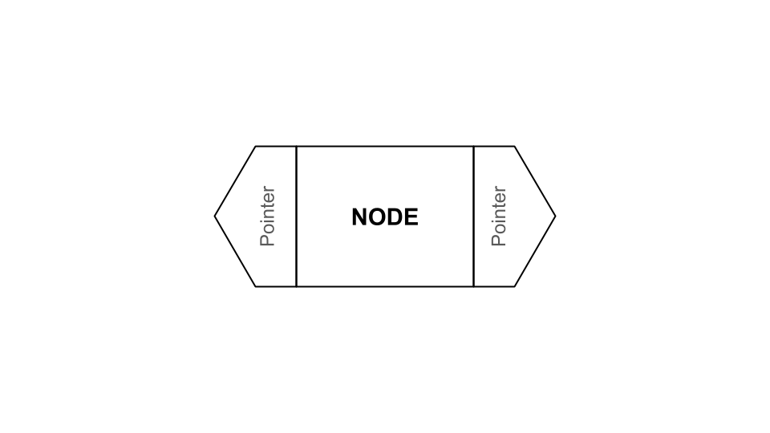
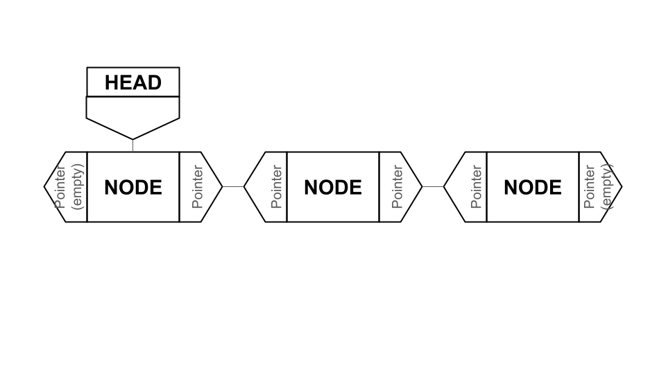
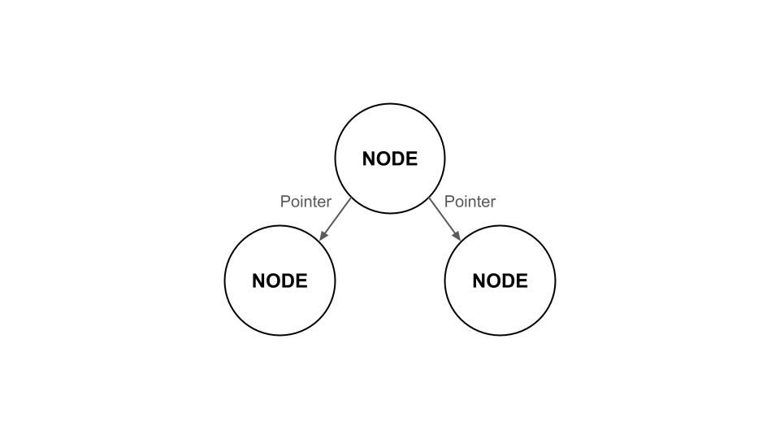
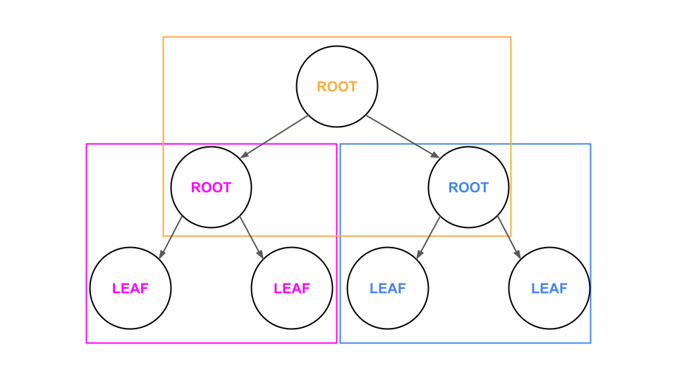
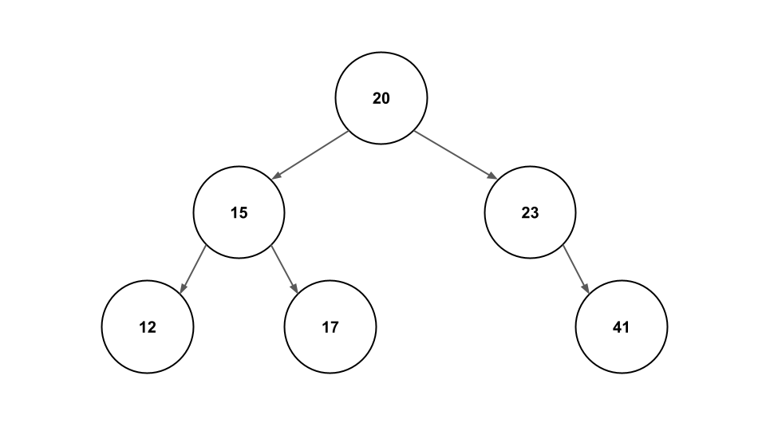

# Trees
When dealing with big data, having lots ways to store and search across big numbers can make a huge difference in code efficiency and simplicity. One such way to store and search across numbers efficiently is called a **Tree**. Trees are made up of chunks of data that point to other chunks of data. Using simple rules to store and sort through numbers can make trees exceedingly efficient to look at and help us know where to find numbers without having to store much more information. 

## Parts of a Tree

Trees are made up of multiple parts. Understanding how all of these different parts work together will help us understand what a tree is, what it can do, and how we use it. 

Two of the most critical parts to understand about trees are **Nodes** and **Pointers**.
### Nodes and Pointers

**Nodes** are boxes that hold information. They're a similar concept to variables, except that they don't come with a name like variables do. Instead, we find **Nodes** by using **Pointers**. 

Think of **Nodes** like treasure you'd find along a scavenger hunt, and **Pointers** are the clues. **Pointers** tell you where to go from one part of the scavenger hunt to the next. To connect **Nodes** together, we simply need to attach **Pointers** to them so we know where to go next. It might look something like this: 



When we put this in a list-format, it creates something called a **Linked List**, where each item, or node, points to the one in front of and behind it. That would look something like this: 



Notice that there's a "Head" that points to the first node. That's so that we can always find our way to the start of the list. 

A tree is pretty similar to this, except that, instead of only pointing once forward and once backward, trees point to more than one other node, like this: 



Now that we know what Nodes and Pointers are, let's learn about two other important parts of trees: Roots and Leaves

### Roots and Leaves

Much like how a **Linked List** has a **Head**, a **Tree** has a **Root**. 

Nodes that point to other nodes (one or more) are called **Roots**.

Nodes that don't point to any other nodes are called **Leaves**.

**Roots** can even point to other **Roots**. This is where **Sub-trees** come from.

### Sub-trees

**Sub-trees** sound complicated, but are pretty simple. They happen when a node points to a node that isn't a leaf, or has its own nodes that it points to. Consider the following tree: 



The Pink and Blue boxes both surround "Sub-trees" or trees that could be trees all on their own, with at least one root. They come off of the Orange tree. All three boxes are full trees. 
Note that the Blue root and the Pink root are not leaves, because they point to other nodes. 

These are what make up trees. However, so far, we've only looked at one kind a tree. What different kinds of trees are there, and what makes them different? 

## Types of Trees
### Binary Tree

A **Binary Tree** is what we've been looking at so far. Each node points to no more than two other nodes. This makes things pretty simple because there will only ever be a left and/or a right pointer for each node. 

Nodes on **Binary Trees** can also point to only one none, or none at all. 

### Binary Search Tree

A **Binary Search Tree** is similar to a **Binary Tree** in all ways except that we add simple rules to make items easy to find. 

These rules are similar to what we used for **Sets**, and make it easy to find items in our tree. The rule is, if the number is greater than the root than it goes to the right, and if it's less than the root it goes to the left. 

Consider the following tree:



`20` is the root at the top. Now we want to put in the number `23`. `23` is greater than `20`, so we put it on the right. 

Then we want to add `15`. `15` is less than 20 so it goes on the left. We do the same for `12`, `17`, and `41`, following these rules to put each number in the correct place. 

If we wanted to add the number `16`, it would go to the left of `20` (20 > 16), to the right of `15` (16 > 15), and to the left of `17` (17 > 16). 

If this doesn't make sense yet, try adding the number `21` following these rules. 

This makes finding numbers very efficient! Let's say we wanted to know if the number `12` was in our tree. 12 < 20, so we look to the left. 12 < 15, so we look to the left again. This node is equal to `12`, so we've found it! 

If we were looking for `13`, we would have gone to the right of `12` and found nothing, which means that `13` is not in our tree. 

This is very efficient, because each time we go down a new branch of the tree, we are splitting the search area in half. Mathmatically, this results in an O(log n) efficiency for searching, which is VERY good, since even massive numbers will stay within a resonable number of program actions. 

But what happens if our tree gets lop-sided? 

### Balanced Tree

Imagine we tried to add numbers in this order: `1, 2, 3, 4, 5`. 

Our root would be `1`, and then we would add `2` to the right. `3` would go to the right of `2`, and `4` would go to the right of `3`. Now our tree would start to look more like a **linked list** than a tree, since there's only one path. Once this happens, our Big O Notation begins to approach O(n) rather than our beloved O(log n). How do we fix this?

The solution is a **Balanced Tree**. 

A **Balanced Tree** uses crazy math to adjust all the nodes in a tree to make sure no branch is ever more than one node longer than the shortest branch. 

This means that every time an item is added or removed, the program will check to see if everything is balanced and move nodes, pointers, etc. until the tree is where it needs to be. 

This ensures maximum efficiency, and a guaranteed O(log n). 

We won't go too much into detail on how a program does this, but just know that balanced trees are possible and very useful.

## Why use a tree? 

Now that we understand what a tree is made of, and what kinds of trees exist, it might be obvious why a tree would be useful: efficiency. 

O(log n) is super valuable when dealing with massive numbers. It makes finding values in a tree very efficient and removes many of the challenges of sets, like multiple values hashing into the same spot. 

However, it does come with its own challenges. 

Binary Search Trees are quite complicated and each node has to store two additional sets of data (pointers). In addition, Balanced Binary Search Trees require a lot of work to re-balance if a new item has been added. 

Converting Binary Trees to other forms of data, such as lists or strings, also uses **Recursion** (the process of a function calling itself) and can take a lot more work than a Linked List, Set, or other data structures. 

This means that Binary Search Trees are best used when search efficiency is important and especially more important than the efficiency of adding items or converting items. 

## Using trees (and Efficiency of Operations)

Now we know what a tree is and why we use it, but how do we use it? 

C# does not have a built in tree class, so we will be working with a pre-made one. You can see how a Binary Search Tree is built by looking [here](/TreesExample/BinarySearchTree.cs) in the practice problem. 

We'll go over some of the methods in this specific tree class so you can use them for the project. 

- Insert(int)

Places a new item wherever it belongs in the tree. 
As long as the tree is balanced, this method has an efficiencey of O(log n).

- Contains(int) -> returns bool

This checks to see if the tree contains the provided int and returns a true/false bool. 
As long as the tree is balanced, this method has an efficiencey of O(log n).

- Enumerator (accessed by looping through a foreach loop)

This Binary Search Tree is Enumerable, meaning we can look through each item one at a time. 
Enumerating through has an O(n) efficiency. 

## Example Problem - The Perfect Tree

Let's made a simple tree that stores a large set of sorted numbers. We want the perfect tree with perfect numbers only, so we will adjust our tree to make it perfect. (: 

Our BinarySearchTree class has a method that takes a sorted list and turns it into a balanced tree, so let's start with that. 

```csharp
namespace BinaryTree;

BinarySearchTree tree = BinarySearchTree();
```

Now that we have our sorted tree, we want to start doing stuff with it. 

Because 12 is a wonderful number, we're going to add the number 12. 

```csharp
tree.Insert(12);
```

Because 12 really is the best number, we really want to make sure it's in there. We're going to run: 

```csharp
Console.WriteLine(tree.Contains(12));
```

This will print True, because we have the number 12 in our tree. (:

Now, let's add some more of the best numbers: 

```csharp
tree.Insert(42); 
tree.Insert(6); 
tree.Insert(2); 
tree.Insert(14); 
tree.Insert(32); 
```

We want to print them all out nice and neat, so let's use the enumerator functionality and iterate through it using foreach: 

```csharp
foreach (int num in tree){
    Console.WriteLine(num);
}
```

This will print out 
```
2
6
12
14
32
42
```

See how they're all in order? That's because of how our program stores the numbers. 

Our tree can also be turned straight into a string:

```csharp
Console.WriteLine(tree);
```

This will print out: 
```
<Bst>{2, 6, 12, 14, 32, 42}
```

Hurray! We have a beautiful tree. (: 

Now it's your turn! 

## Practice Problem - Breakfast Bingo

Our Breakfast Restaurant likes to run a daily Breakfast Bingo. 

However, the players are tired from eating all those carbs and need help figuring out if a number has been called in the bingo yet. 

In this project, you will be implementing the pre-built BinarySearchTree class to create a simple program that allows numbers to be added, searched for, sorted, and printed out for our restaurant customers. 

The starter project can be found [here](TreesExample\Program.cs) and the solution can be found [here](TreesExampleSolution\Program.cs). Give the project a good go on your own and then look back at the solution when you finish or need help making progress. 

You will need to fill out the following methods in the Bingo class: PrintNums, IsCalled, and NextNum.

The output should look something like this, but with different numbers. Be sure to check that it's properly reporting what numbers have been called, since your values will be different: 

```
Calling numbers...
The next number is 22!
The next number is 63!
The next number is 75!
Numbers: 22, 63, 75,
The number 5 has not been called.
The number 50 has not been called.
The number 75 has been called!
The next number is 7!
The next number is 17!
Numbers: 7, 17, 22, 63, 75,
```

Return to [Home](0-welcome.md)